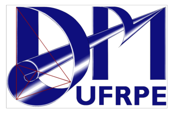

<!-- https://marpit.marp.app/ -->
<style>
    :root {
         /* --color-background: #101010; !important; */ 
	 /* --color-foreground: #1b2d4f !important; */ 
    h1, h2, h3,a {
    font-family: IBM Plex Mono;
    
    }
    
}

header,
footer , a, h3 {
color:  #808080;
}
h1,  h2, h4 {
color: #1b2d4f;
}

</style>




## O ecossistema Python para matemática computacional
### Leon Silva

leon.silva@ufrpe.br

---
#### Sobre mim


- Lic. em Matemática (UFRPE)
- Mestre em Matemática (UFC)
- Doutor em Ciência da Computação (UFPE)

&nbsp;&nbsp;&nbsp;&nbsp;&nbsp;&nbsp;&nbsp;&nbsp;&nbsp;&nbsp;&nbsp;&nbsp;&nbsp;&nbsp;&nbsp;&nbsp;&nbsp;&nbsp;&nbsp;&nbsp;&nbsp;&nbsp;&nbsp;&nbsp;&nbsp;&nbsp;&nbsp;&nbsp;&nbsp;&nbsp;&nbsp;&nbsp;  

---
#### Outline
- Um pouco sobre Python 
- Comparações sobre outros softwares
- Um passeios sobre a sintaxe do Python
- Pacotes para Matemática computacional
- Onde usar Python


---
#### Por que Python?


---

#### Necessidade dos cientistas:
<!-- header: Por que Python? -->
 - Carregar os dados
 - Manipular e processar dados
 - Manipular e operar com expressões algébricas
 - Visualizar dados e resultados
 - Alta qualidade e precisão
 
---

#### Pontos fortes do Python:

<!-- header: Por que Python? -->
- Não inventou a roda
- Fácil de aprender
- Legível
- Código eficiente
- Multipropósito

---


<!-- header: Comparando com outros softwares -->

#### C, C++, Fortran
- **Prós**
   - Muito rápida. Muito!   
   - Grátis
- **Contra**
   - Sintaxe dolorosa
   - Gerenciamento manual da memória
   - Difíceis para não programadores.
---


#### Linguagem  Julia 
- **Prós**
   -  Rápido e simples
   - Capacidade de integração com Python
- **Contra**
   - Limitado a cálculos numéricos
   - Pouco testado
---

 
 #### Matlab

- **Prós**
  - Muitos algoritmos disponíveis
  - Rápido
  - Editor integrado e agradável
  - Suporte
- **Contra**
  - Linguagem pobre
  - Código fechado 
  - Pago
---


 #### Maple, Mathematica
- **Prós**
   - Especializados em computação algébrica   
   - Editor próprio e útil
   - Documentação profissional
   - Suporte
- **Contra**   
   - Sintaxe pobre e confusa 
   - Código fechado 
   - Não é grátis
---


 #### Python
- **Prós**
   - Várias bibliotecas para Matemática Computacional
   - Linguagem poderosa e simples
   - Gratuito e de código aberto
   - Variedade de editores disponíveis
- **Contra**
   - Nem todos os algoritmos estão disponíveis (ainda)
   

---
<!-- header: Ecossistema científico Python -->


---
<!-- header: Rápido tutorial -->
#### Um passeio por Python e Matemática


---
<!-- header: Tutorial -->

### Matemática
$$\large\sum_{n=0}^{10}3n$$
### Python
 ```python
soma = 0
for n in range(11):
    sum +=3*n
 ```
---

### Matemática
$$\large\prod_{n=1}^{10}2n$$
### Python
 ```python
produto = 0
for n in range(1, 11):
    sum *=2*n
 ```
 ---


### Matemática
$$\large A = \{n^2, \forall n \in\mathbb{N}; 20< n< 100 \}$$
### Python
 ```python
a = 20
b = 100
A = [n for n in range(a, b+1)]
 ```
 ---


 
#### Matemática
- Sequência de Fibonacci
$
 \begin{cases}
    F_0 =  0, F_1=1 \\
    F_n = F_{n-1} + F_{n-2} & \text{para}\; n>1
  \end{cases}
$
#### Python
 ```python
def F(n):
  if n==0:
    return 0
  elif n<=2:
        return 1
return F(n-1) + F(n-2)
 ```
 ---

 
#### Matemática
- Resolver: $\,\,ax^2 + bx+ c=0$

#### Python
 ```python
x = (b**2)-(4*a*c) 
if x < 0 :
        print ("Raiz negativa nao pode ser extraida.")
else :
    x = math.sqrt(x)
    x1 = (-b + x)/(2*a);  
    x2 = (-b - x)/(2*a)
    print ('x1 = ',x1, '\nx2 = ', x2)
 ```
 ---
<!-- header: Pacote do ecossistema -->

 
#### O que é o NumPy?

- Pacote de extensão para Python para matrizes multidimensionais
- Mais perto do hardware (eficiência)
- Projetado para computação científica (conveniência)
- Também conhecido como computação orientada a array

---
<!-- header: NumPy na Nature  -->


---
<!-- header: Comparação com Python  -->
 
#### Python
 ```python
soma = 0
for n in range(11):
    sum +=3*n
 ```

#### NumPy
 ```python
import numpy

soma = numpy.sum(3*numpy.arange(11));
 ```
 ---
<!-- header: Algebra Linear Numérica  -->

#### Matemática
- Dada uma matriz $A$ inversível:
   - Computar a inversa, autovetores e resolver o sistema $\small Ax=b$. 

#### NumPy
 ```python
from numpy import linalg

linalg.inv(A)     #inversa de A

linalg.eigvals(A) #autovalores

linalg.solve(A, b) #Resolve Ax=b
 ```
 ---
<!-- header: Numpy: base para o ecossistema -->

#### Matemática
- Gerar coordenadas de 81 pontos na região $\small R=[0,5] \times [0,5]$,  distribuidos uniformemente.
#### NumPy
 ```python
 import numpy as np

nx, ny = (9, 9)
x = np.linspace(0, 5, nx)
y = np.linspace(0, 5, ny)

xv, yv = np.meshgrid(x, y)
 ```
---
<!-- header: Pacote do ecossistema -->

### O que é o Matplotlib?
- Muito usado para gráficos 2d
- Fornece dados e figuras de qualidade de publicação
- Exporta figuras para diversos formatos
- Suporta simulações dinâmicas
- Está integrado ao NumPy


---

#### Matplotlib: plot $y=\mathrm{sen}{\,x}$ e $y=\cos{x}$
 ```python

# Gráficos 2D

import numpy as np
import matplotlib.pyplot as plt

X = np.linspace(-np.pi, np.pi, 256)
C, S = np.cos(X), np.sin(X)
plt.plot(X, C)
plt.plot(X, S)
plt.show()

```
---

#### Matplotlib: plot $\small z= \mathrm{sen}{\left(\sqrt{x^2+ y^2}\right)}$
 ```python
import numpy as np
import matplotlib.pyplot as plt
from mpl_toolkits.mplot3d import Axes3D

fig = plt.figure()
ax = Axes3D(fig)
X = np.arange(-4, 4, 0.25)
Y = np.arange(-4, 4, 0.25)
X, Y = np.meshgrid(X, Y)
R = np.sqrt(X ** 2 + Y ** 2)
Z = np.sin(R)

ax.plot_surface(X, Y, Z, cmap=plt.cm.hot)
plt.show()
```
---

#### Matplotlib: Gráfico de Pizza

 ```python
import matplotlib.pyplot as plt

legendas = 'Fatia 1', 'Fatia 2', 'Fatia 3', 'Fatia 4'
porcentagem = [15, 30, 45, 10]
estourar = (0, 0.1, 0, 0)  

fig, ax = plt.subplots()
ax.pie(porcentagem, estourar, legendas, autopct='%1.0f%%')
ax.axis()  
plt.show()
```
---

#### O que é o Scipy?
- Pacote principal para algoritmos científicos em Python
- Opera com eficiências matrizes do NumPy
- Dedicadas a muitas aplicações científicas
---

#### Matemática
- Encontrar mínimo da função escalar $f(x)= x^2+ 10\sin{x}, \, 0<x< 10$.
#### SciPy
 ```python
import numpy as np
from scipy import optimize

def f(x):
    return x**2 + 10*np.sin(x)

optimize.minimize(f, x0=0)
```
---

#### Matemática
- Calcular $\displaystyle\int_1^{10}\frac{\sin{x}}{x}\, dx$
#### SciPy
 ```python
import numpy as np
from scipy.integrate import quadrature


f = lambda x: np.sin(x)/x
quadrature(f, 1, 10)
```
---

#### Matemática
- Resolver a EDO $\small\begin{cases}
\dfrac{dy}{dt}=2y & 0\leq t\leq 4\\
y(0)=1
\end{cases}$
#### SciPy
 ```python
def calc_derivada(ypos, tempo):
    return -2 * ypos

from scipy.integrate import odeint

t = np.linspace(0, 4, 40)
y = odeint(calc_derivada, y0=1, t)
```
---

#### O que é o SymPy?
- Operações algébricas em expressões algébricas
- Operação exatas do Cálculo
- Resolve equações algébricas
- Resolve EDO's
---

#### Matemática
- Expandir a expressão $(x+1)^6$
#### SymPy
 ```python
import sympy

x = sympy.symbols("x")

sympy.expand((x+1)**6)
```
---

#### Matemática
- $\small \lim_{x\to 0}\frac{\sin{x}}{x}$ 
-   $\small \frac{d}{dx}\left[\sin{x}\right]$
- $\small \int\log{x}\,dx$
#### SymPy
 ```python
 import sympy 
# cálculos exatos
sympy.limit(sympy.sin(x)/x, x,0) #limite

sympy.diff(sympy.sin(x), x) #derivada

sympy.integrate(sympy.log(x), x) #integral
```
---

#### Matemática
- Resolver $\small \begin{cases}
x + 5y = 2\\
-3x + 6y = 15
\end{cases}$
#### SymPy
 ```python
import sympy as sym

x, y = sym.symbols('x, y')

sym.solve((x + 5*y-2, -3*x + 6*y-15), (x, y))
```
---

#### Matemática
- Resolver a EDO $\small y''+ 9y=0$
#### SymPy
 ```python
from sympy import Function, dsolve, symbols

x = symbols('x')
y = Function('y')

ddy = sympy.diff(y(x), x, x)

dsolve(ddy +9*y(x), y(x))
```
---

#### O que é o Scikit-image?
- Processamento de imagens
   - Algoritmos:
     - segmentação
     - transformações geométricas
     - manipulação de cor
     - filtros

---

#### Processamento
- Lendo arquivos da web (logo DM-\UFRPE)
#### 
 ```python
from skimage import io
import matplotlib.pyplot as plt

url = https://pymat.com.br/assets/images/logos/logo_dm.png

logo_dm = io.imread('url')
plt.imshow(logo_dm)
plt.axis('off')
plt.show()
```
---

#### Processamento
- RGB para tons de cinza
#### Scikit-image
 ```python
from skimage import  color 

logo_dm_grayscale = color.rgb2gray(logo_dem)
plt.imshow(logo_dm_grayscale, cmap=plt.cm.gray)
plt.axis('off')
plt.show()
```
---

#### Processamento
- Trocar o primeiro fundo com o segundo
#### Scikit-mage
 ```python
from skimage import  filters

# Otsu's method.
val = filters.threshold_otsu(grayscale) 
plt.imshow(grayscale < val, cmap=plt.cm.gray)
plt.axis('off')
plt.show()
```
---
#### Outros pacotes do ecossistema


---

<!-- header: Baseado em python -->


#### SageMath: o Capitão Planeta
- Inclui os pacotes Python:
   - NumPy
   - SciPy
   - SymPy 
   - Matplotlib
   - NetworkX

- Além do:
   - R
   - Maxima,  GAP e outros 
---
<!-- header: PyMat 2021-->
####  E agora?


---
<!-- header: Ecossistema Python -->
#### Onde usar o Python e seus ecossistema


---
<!-- header: Agradecimentos -->


