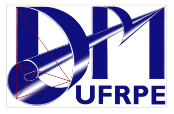
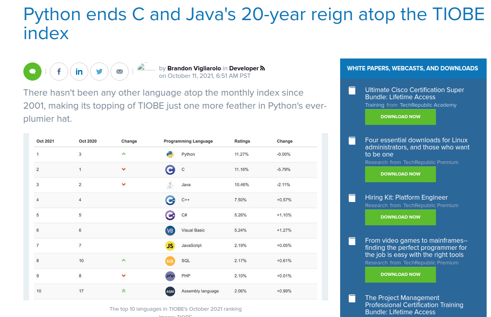

<!-- https://marpit.marp.app/ -->

## Python e Problemas Matemáticos Desafiadores
### Leon Silva

leon.silva@ufrpe.br

---
#### Sobre mim

- Lic. em Matemática (DM - UFRPE)
- Mestre em Matemática (DMAT - UFC)
- Doutor em Ciência da Computação (Cin-UFPE)

&nbsp;&nbsp;&nbsp;&nbsp;&nbsp;&nbsp;&nbsp;&nbsp;&nbsp;&nbsp;&nbsp;&nbsp;&nbsp;&nbsp;&nbsp;&nbsp;&nbsp;&nbsp;&nbsp;&nbsp;&nbsp;&nbsp;&nbsp;&nbsp;&nbsp;&nbsp;&nbsp;&nbsp;&nbsp;&nbsp;&nbsp;&nbsp;  

---
#### Outline
- Um pouco sobre Python 
- Teoremas Resolvidos com ajuda de Computadores

---
#### Por que Python?

---
<!-- header: Primeira do Ranking TIOBE -->

---

#### Necessidade dos matemáticos:
<!-- header: Por que Python? -->
 - Manipular e operar com expressões algébricas
 - Realizar cálculos numéricos
 - Visualizar gráfico de dados e funções
 - Alta qualidade e precisão
 
---

#### Pontos fortes do Python:

<!-- header: Por que Python? -->
- Não inventou a roda
- Fácil de aprender
- Legível
- Código eficiente
- Multipropósito

---
<!-- header: Onde usar o Python? -->
#### Ambientes disponíveis 

---

<!-- header: Teoremas provados com a ajuda de programas de computador -->
#### Teorema das Quatro Cores

_Dado um mapa plano, dividido em regiões, quatro cores são suficientes para colori-lo de forma a que regiões vizinhas não partilhem a mesma cor._
<!-- Inicialmente, esta prova não foi aceita por todos os matemáticos porque a prova assistida por computador era inviável para um humano verificar manualmente . [2]A prova ganhou ampla aceitação desde então, embora alguns céticos permaneçam. Não existe provas do teorema que não faça uso de computadores -->

- Appel-Haken (1976)
- Robertson, Sanders, Seymour e Thomas (1997)
-  Georges Gonthier (2005)
---

<!-- header: Teoremas provados com a ajuda de programas de computador -->
#### Conjectura de Kepler (1611)

 O problema do empacotamento ótimo da esfera em uma caixa. A Conjectura de Kepler era um problema famoso da geometria discreta, que demandava pela maneira mais eficiente de empilhar esferas em um dado espaço.

Em 1611 Kepler conjecturou que esse empilhamento piramidal, que é usado, por exemplo, pelos verdureiros para organizar suas mercadorias, é também o método ideal que permite agrupar um maior número de esferas no menor espaço possível. 

 <!-- https://muralcientifico.com/2017/06/19/publicado-artigo-que-prova-a-conjectura-de-kepler-problema-matematico-nao-resolvido-por-400-anos/ -->
 
 - Thomas Hales (1998)
 - Publicado (2017)
---

<!-- header: ? Teoremas provados com a ajuda de programas de computador -->
#### Outros Teoremas e resultados

- Atrator de Lorenz (2002)
- Soluções ideais para o Cubo de Rubik (2010)

---
<!-- header: Agradecimentos -->

