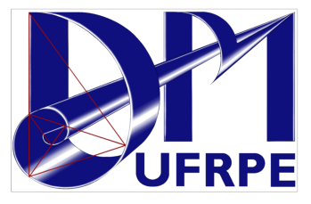
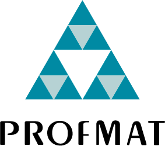
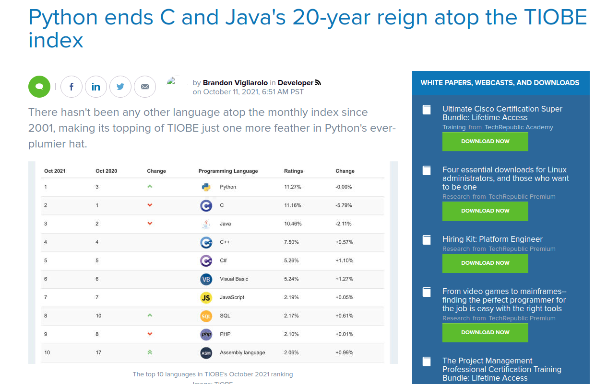

<!-- https://marpit.marp.app/ -->

## Python e Problemas Matemáticos Desafiadores
### Leon Silva

leon.silva@ufrpe.br

---
#### Sobre mim

- Lic. em Matemática (DM - UFRPE)
- Mestre em Matemática (DMAT - UFC)
- Doutor em Ciência da Computação (Cin-UFPE)
- Professor no DM-UFRPE

&nbsp;&nbsp;&nbsp;&nbsp;&nbsp;&nbsp;&nbsp;&nbsp;&nbsp;&nbsp;&nbsp;&nbsp;&nbsp;&nbsp;&nbsp;&nbsp;&nbsp;&nbsp;&nbsp;&nbsp;&nbsp;&nbsp;&nbsp;&nbsp;&nbsp;&nbsp;&nbsp;&nbsp;&nbsp;&nbsp;&nbsp;&nbsp;  

---
#### Outline
- Um pouco sobre Python 
- Teoremas Resolvidos com ajuda de Computadores

---
#### Por que Python?

---
<!-- header: Primeira do Ranking TIOBE -->

---

#### Necessidade dos matemáticos:
<!-- header: Por que Python? -->
 - Manipular e operar com expressões algébricas
 - Realizar cálculos numéricos
 - Visualizar gráfico de dados e funções
 - Alta qualidade e precisão
 
---

#### Pontos fortes do Python:

<!-- header: Por que Python? -->
- Não inventou a roda
- Fácil de aprender
- Legível
- Código eficiente
- Multipropósito

---
<!-- header: Onde usar o Python? -->
#### Ambientes disponíveis 

---

<!-- header: Teoremas provados com a ajuda de programas de computador -->
#### Teorema das Quatro Cores

_Dado um mapa plano, dividido em regiões, quatro cores são suficientes para colori-lo de forma a que regiões vizinhas não partilhem a mesma cor._
<!-- Inicialmente, esta prova não foi aceita por todos os matemáticos porque a prova assistida por computador era inviável para um humano verificar manualmente . [2]A prova ganhou ampla aceitação desde então, embora alguns céticos permaneçam. Não existe provas do teorema que não faça uso de computadores -->

- Appel-Haken (1976)
- Robertson, Sanders, Seymour e Thomas (1997)
-  Georges Gonthier (software de prova, 2005)
---

<!-- header: Teoremas provados com a ajuda de programas de computador -->
#### Conjectura de Kepler (1611)

 A Conjectura de Kepler era um problema famoso da geometria discreta, que demandava pela maneira mais eficiente de empilhar esferas em um dado espaço.

- Thomas Hales (1998)
- Flyspeck project team (software de prova, 2014)
- Publicado (2017)

 <!-- https://muralcientifico.com/2017/06/19/publicado-artigo-que-prova-a-conjectura-de-kepler-problema-matematico-nao-resolvido-por-400-anos/ -->
 

 
---

<!-- header: ? Teoremas provados com a ajuda de programas de computador -->
#### Outros Teoremas e resultados

- Atrator de Lorenz (2002)
- Soluções ideais para o Cubo de Rubik (2010)

---
<!-- header: Agradecimentos -->

