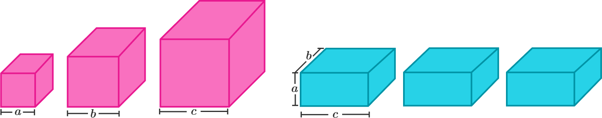

<!-- Slide 1: Título e Informações -->
## Consequências da Desigualdade de Cauchy

**Palestrante:** Leon Silva (leon.silva@ufrpe.br)
**Instituição:** DM-UFRPE
**Evento:** Live - É matemática, Ôxente!
**Data:** 05/09

---

<!-- Slide 2: Exemplo de Problema Matemático -->

## Introdução

- A desigualdade de Cauchy-Schwarz é uma das mais úteis e conhecidas na matemática.
- Desenvolvida por **Cauchy** e **Schwarz**, ela aparece em Álgebra Linear, Análise e Teoria das Probabilidades.
- Fundamental em olimpíadas de matemática, permitindo a resolução de problemas complexos.
---
### Sumário

1. Motivação
2. Desigualdade de Cauchy-Schwarz
3. Lema de Titu
4. Aplicações em Olimpíadas de Matemática
   - Gazeta Matemática
   - OPEMAT
   - Competição Tcheco-Eslovaca, 1999
   - Olimpíada de Matemática da Irlanda, 1999
5. Fórmula de Herão
6. Conclusão

---
### Problema Motivador (PROFMAT - 2012)

Prove que, para quaisquer números reais positivos $a$, $b$ e $c$:

$$
\frac{a^3}{a^2 + ab + b^2} + \frac{b^3}{b^2 + bc + c^2} + \frac{c^3}{c^2 + ca + a^2} \geq \frac{a + b + c}{3}
$$

**Fonte**: Tournament of the Towns, 1998

---
### Desigualdade de Cauchy-Schwarz

**Teorema**. Sejam $a_1, \ldots, a_n$ e $b_1, \ldots b_n$ números reais. Então:

$$
\left(\sum_{i=1}^n a_i^2 \right) \left( \sum_{i=1}^n b_i^2 \right) \geq \left( \sum_{i=1}^n a_ib_i \right)^2
$$

---
### Exemplo 1: Gazeta Matemática

 Prove que para números reais não negativos \(a, b, c\):

$$
\left(ax^2 + bx + c\right)\left(cx^2 + bx + a\right) \geq \frac{(a+b+c)^2 x^2}{3}
$$

---
### Solução.

Como todos os números envolvidos são não negativos, podemos expandir o lado direito da desigualdade e afirmar que

$$
\left(ax^2+bx+c\right)\left(cx^2+bx+a\right) \geq \left(a^2x^2+b^2x^2+c^2x^2\right)
$$

---
Reescrevendo o lado direito da desigualdade acima e aplicando **desigualdade de Cauchy–Schwarz**, obtemos

$$
\left(a^2x^2 + b^2x^2 + c^2x^2\right) =
\left(\frac{x^2}{(\sqrt{3})^2} + \frac{x^2}{(\sqrt{3})^2} + \frac{x^2}{(\sqrt{3})^2}\right) \left(a^2 + b^2 + c^2\right)
$$

$$
\geq \left(\frac{ax}{\sqrt{3}} + \frac{bx}{\sqrt{3}} + \frac{cx}{\sqrt{3}}\right)^2
$$

$$
= \frac{\left(a + b + c\right)^2 x^2}{3}
$$

---
### Exemplo 2: 

 Sejam $a, b, c, x, y, z$ os comprimentos dos lados de dois triângulos quaisquer. Prove que:

$$
x^2(b^2 + c^2 - a^2) + y^2(a^2 + c^2 - b^2) + z^2(a^2 + b^2 - c^2) > 0
$$

---
### Solução.

Desenvolvendo o lado esquerdo da desigualdade é possível observar que o problema equivale mostrar que

$$
(x^2 + y^2 + z^2)(a^2 + b^2 + c^2) > 2(x^2a^2 + y^2b^2 + z^2c^2)
$$

---

### Fórmula de Herão

Dada um triângulo com lados de comprimentos $a$, $b$ e $c$, e semi-perímetro $s = \frac{a + b + c}{2}$, a área $A$ do triângulo pode ser calculada pela **Fórmula de Herão**:

$$
A = \sqrt{s(s - a)(s - b)(s - c)}
$$

Usando a Fórmula de Herão podemos afirmar que as expressões são positivas:

 $$ \left(a+b+c\right)\left(b+c-a\right)\left(a+c-b\right)\left(a+b-c\right)$$
 $$
      \left(x+y+z\right)\left(y+z-x\right)\left(x+z-y\right)\left(x+y-z\right)$$

---
Desenvolvendo  as últimas duas expressões encontramos as seguintes desigualdades

$$(a^2 +b^2+c^2)^2 - 2(a^4+b^4+c^4)>0,$$
   $$ (x^2 +y^2+z^2)^2 - 2(x^4+y^4+z^4)>0,$$

---

Reescritas como

$$a^2 +b^2+c^2 >\sqrt{2(a^4+b^4+c^4)}$$
$$x^2 +y^2+z^2 > \sqrt{2(x^4+y^4+z^4)}$$

fornecendo que:

$$
(a^2 + b^2 + c^2)(x^2 + y^2 + z^2)
$$

é maior do que:

$$
2\sqrt{(a^4 + b^4 + c^4)(x^4 + y^4 + z^4)}.
$$

---
### Concluindo ..

Aplicando **desigualdade de Cauchy–Schwarz**:

$$
2\sqrt{(a^4 + b^4 + c^4)(x^4 + y^4 + z^4)}
\geq 2(x^2a^2 + y^2b^2 + z^2c^2)
$$

---

### Exemplo 3: Organização Brilliant

Sejam \(a, b, c\) (\(a > b > c\)) números inteiros e primos entre si. De acordo com a Figura abaixo, temos dois conjuntos de caixas:

1. Três caixas cúbicas na cor rosa com seus respectivos comprimentos \(a\), \(b\) e \(c\);
2. Três paralelepípedos azuis idênticos cujos lados medem \(a\), \(b\) e \(c\).

---

## Imagem Ilustrativa do blocos
Qual conjunto possui uma área de superfície total maior?

---
### Solução

- Área total da superfície de todas as caixas rosas é $6a^2+6b^2+6c^2$ 
- Área total das superfície de todas caixas azuis é $6ab + 6bc +6ca$, 

- O problema pode ser resolvido usando desigualdades.

---

### Desigualdade de Cauchy–Schwarz

- A desigualdade a seguir é obtida utilizando a desigualdade de Cauchy–Schwarz:

$$
\left(a^2 + b^2 + c^2\right)\left(b^2 + c^2 + a^2\right) \geq \left(ab + bc + ca\right)^2
$$

---

### Simplificação da Desigualdade

Sabemos que:

$$
\left(a^2 + b^2 + c^2\right)\left(b^2 + c^2 + a^2\right) = \left(a^2 + b^2 + c^2\right)^2
$$

Dessa forma, obtemos:

$$
\left(a^2 + b^2 + c^2\right) \geq ab + bc + ca
$$

---

 Multiplicando ambos os lados por 6, temos:

$$
6a^2 + 6b^2 + 6c^2 \geq 6ab + 6bc + 6ca
$$

Uma vez que \(a, b, c\) são primos entre si e, portanto, não proporcionais, concluímos que:

$$
6a^2 + 6b^2 + 6c^2 > 6ab + 6bc + 6ca
$$

---
### Concluindo
Isso significa que os cubos (caixas rosas) terão sempre uma área total da superfície maior do que os paralelepípedos (caixas azuis).

---
### Exemplo: OPEMAT 2019

Sejam $a_1, a_2, a_3$ e $b_1, b_2, b_3$ todos números reais positivos. Sabendo que $a_1a_2a_3 = 1$ e $b_1b_2b_3 = \pi^3$, mostre a validade da seguinte desigualdade:

$$
\frac{b_1^2 + b_2^2 + b_3^2}{a_1^2} + \frac{b_1^2 + b_2^2 + b_3^2}{a_2^2} + \frac{b_1^2 + b_2^2 + b_3^2}{a_3^2} \geq 9\pi^2
$$

---
### Solução

Reescrevendo a desigualdade acima como:

$$
\left(\frac{1}{a_1^2} + \frac{1}{a_2^2} + \frac{1}{a_3^2}\right) \cdot (b_1^2 + b_2^2 + b_3^2)
$$

---

Podemos aplicar a **desigualdade de Cauchy-Schwarz** e obter:

$$
\left(\sum_{i=1}^3 \frac{1}{a_i^2}\right) \cdot \left(\sum_{i=1}^{3} b_i^2\right) \geq \left(\sum_{i=1}^3 \frac{1}{a_i} \cdot b_i\right)^2 = \left(\frac{b_1}{a_1} + \frac{b_2}{a_2} + \frac{b_3}{a_3}\right)^2
$$
---

Por outro lado, a **desigualdade entre as médias aritmética e geométrica** (AM-GM) nos fornece:

$$
\frac{\frac{b_1}{a_1} + \frac{b_2}{a_2} + \frac{b_3}{a_3}}{3} \geq \sqrt[3]{\frac{b_1 \cdot b_2 \cdot b_3}{a_1 \cdot a_2 \cdot a_3}} = \pi
$$

Logo, segue que:

$$
\frac{b_1}{a_1} + \frac{b_2}{a_2} + \frac{b_3}{a_3} \geq 3\pi
$$

---
## Lema de Titu

**Lema de Titu:**  
Se $a_1, a_2, \ldots, a_n$ e $b_1, b_2, \ldots, b_n$ são números reais positivos, então:

$$
\frac{a_1^2}{b_1} + \frac{a_2^2}{b_2} + \cdots + \frac{a_n^2}{b_n} \geq \frac{(a_1 + a_2 + \cdots + a_n)^2}{b_1 + b_2 + \cdots + b_n}
$$

---
### Exemplo: Olimpíada de Matemática, Irlanda 1999

Sejam $a, b, c, d$ números reais positivos que satisfazem $a + b + c + d = 1$. Prove que:

$$
\frac{a^2}{a+b} + \frac{b^2}{b+c} + \frac{c^2}{c+d} + \frac{d^2}{d+a} \geq \frac{1}{2}
$$

---
### Solução

Segue do **Lema de Titu**:

$$
\frac{a^2}{a+b} + \frac{b^2}{b+c} + \frac{c^2}{c+d} + \frac{d^2}{d+a} \geq \frac{\left(a + b + c + d\right)^2}{2\left(a + b + c + d\right)} = \frac{1}{2}
$$

---
### Exemplo: Competição Tcheco-Eslovaca 1999

Sejam $a, b, c$ números reais positivos quaisquer. Prove a desigualdade:

$$
\frac{a}{b+2c} + \frac{b}{c+2a} + \frac{c}{a+2b} \geq 1
$$

---

### Solução.

Primeiramente, reescrevemos o lado direito da desigualdade como:

$$
\frac{a^2}{a(b+2c)} + \frac{b^2}{b(c+2a)} + \frac{c^2}{c(a+2b)}
$$

---

Em seguida, aplicamos o **Lema de Titu**, obtendo:

$$
\frac{a}{b+2c} + \frac{b}{c+2a} + \frac{c}{a+2b} \geq \frac{(a+b+c)^2}{3(ab + bc + ca)}
$$

Portanto, é suficiente mostrar que:

$$
(a+b+c)^2 \geq 3(ab + bc + ca)
$$

---

Sabemos que:

$$
(a+b+c)^2 = a^2 + 2ab + b^2 + 2ac + 2bc + c^2
$$

Isso implica que:

$$
3(a+b+c)^2 - 3(a^2 + b^2 + c^2) = 6(ab + bc + ca)
$$

---

Daí, aplicando novamente a **desigualdade de Cauchy-Schwarz**:

$$
3(a^2 + b^2 + c^2) \geq (a+b+c)^2
$$

Combinando com a igualdade anterior, temos:

$$
2(a+b+c)^2 = 3(a+b+c)^2 - (a+b+c)^2 \geq 6(ab + bc + ca)
$$
---
### Conclusão

- Ao longo desta apresentação, exploramos várias desigualdades importantes na matemática, incluindo a **Desigualdade de Cauchy-Schwarz** e o **Lema de Titu**, mostrando como elas podem ser aplicadas em problemas de olimpíadas.

- **Desigualdade de Cauchy-Schwarz** é uma das mais poderosas ferramentas para lidar com desigualdades em diversas áreas da matemática, especialmente em álgebra linear e análise.

---

- O **Lema de Titu** destaca como podemos transformar expressões complexas em algo mais manejável, provando ser uma técnica valiosa para resoluções rápidas e eficientes.

- A **Fórmula de Herão**, além de ser uma ferramenta clássica para calcular áreas de triângulos, também serve como um exemplo de como podemos usar expressões matemáticas para resolver problemas geométricos envolvendo desigualdades.

---

### Reflexão Final

Essas desigualdades e suas aplicações não são apenas ferramentas teóricas, mas são extremamente úteis em competições de matemática, onde a criatividade e a técnica precisam andar juntas. O conhecimento dessas desigualdades oferece uma vantagem significativa para quem busca solucionar problemas complexos e demonstrar seus raciocínios de maneira rigorosa e elegante.

---

### Próximos Passos

- Continuar praticando a aplicação de desigualdades em problemas mais avançados.

- Resolver os problemas propostos no artigo

- Explorar outras desigualdades famosas e suas aplicações, como a **Desigualdade de Jensen** e a **Desigualdade de Minkowski**.

---

# Muito obrigado pela atenção!❤️
Se tiverem dúvidas ou quiserem discutir mais sobre o tema, fiquem à vontade para entrar em contato 👍.

