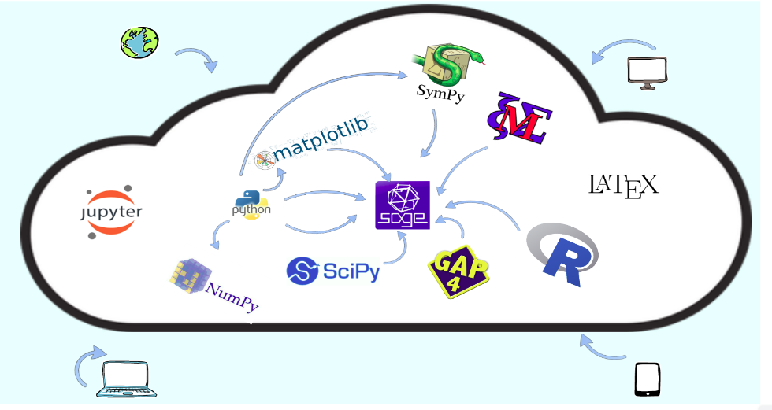

<!-- https://marpit.marp.app/ -->
<style>
    :root {
         /* --color-background: #101010; !important; */ 
	 /* --color-foreground: #1b2d4f !important; */ 
    h1, h2, h3,a {
    font-family: IBM Plex Mono;
    
    }
    
}

header,
footer , a, h3 {
color:  #808080;
}
h1,  h2, h4 {
color: #1b2d4f;
}

</style>

 


#### Título: _Elementos de Computação Matemática com SageMath_


#### Autores: _Leon Silva_, _Marcelo Santos_, _Ricardo Machado_

sagectu@gmail.com


---

<!-- header: Motivação -->

#### Softwares Matemáticos 

- Permitem abordar problemas complexos.
- São cada vez mais utilizados no ensino e pesquisa.
- O SageMath é uma opção gratuita, completa e de código aberto.

&nbsp;&nbsp;&nbsp;&nbsp;&nbsp;&nbsp;&nbsp;&nbsp;&nbsp;&nbsp;&nbsp;&nbsp;&nbsp;&nbsp;&nbsp;&nbsp;&nbsp;&nbsp;&nbsp;&nbsp;&nbsp;&nbsp;&nbsp;&nbsp;&nbsp;&nbsp;&nbsp;&nbsp;&nbsp;&nbsp;&nbsp;&nbsp;  

---


### Material didático

- Escassez de livros sobre o SageMath.
- Material de auxilio para professores prepararem suas aulas
- Permite trabalhos em cooperação


---

#### Benefícios da computação em nuvem

- Acessibilidade e flexibilidade
- Alto desempenho e escalabilidade.
- Permite Trabalhos em cooperação


<!-- ---

#### Software Matemático e a Primeira Imagem de um Buraco Negro

 
  -->

---

<!-- header: Resumo -->

### O livro, o sage e a nuvem

&nbsp;&nbsp;&nbsp;&nbsp;&nbsp;&nbsp;&nbsp;&nbsp;&nbsp;&nbsp;&nbsp;&nbsp;&nbsp;&nbsp;&nbsp;&nbsp;&nbsp;&nbsp;&nbsp;&nbsp;&nbsp;&nbsp;&nbsp;&nbsp;&nbsp;&nbsp;&nbsp;&nbsp;&nbsp;&nbsp;&nbsp;&nbsp;


---


<!-- header: Público -->
### Público-alvo
- **Estudantes de graduação**: Programação, Álgebra, Álgebra Linear, Cálculo, Equações Diferenciais.
- **Pesquisadores**: Ferramenta para pesquisa em diversas áreas.
- **Profissionais**: Aplicações em engenharia, física, economia, criação de material didático.
- **Autodidatas**: Aprenda a usar o SageMath sem conhecimento prévio de computação.


---
<!-- header: Conteúdo -->

#### Capítulos

- Computação em nuvem.
- Introdução ao SageMath.
- Programação
- Matemática elementar.
- Álgebra linear.
- Gráficos e objetos geométricos.
- Cálculo e equações diferenciais.
- Miscelânea de problemas.
- Projetos.


---
#### Apêndices:

- Dicas para usuários avançados.
- Soluções para os problemas.


--- 


<!-- header: Exemplos: um pouco de sage -->


### Matemática
$$\large\sum_{n=0}^{10}3n$$
### Sage
 ```python
soma = 0
for n in range(11):
    soma +=3*n
 ```
---


#### Matemática
- Expandir a expressão $(x+1)^6$
#### Sage
 ```python
expand((x+1)^6)
```

---

#### Matemática
- $\small \lim_{x\to 0}\frac{\sin{x}}{x}$ 
-   $\small \frac{d}{dx}\left[\sin{x}\right]$
- $\small \int\log{x}\,dx$
#### Sage
 ```python
 
# cálculos exatos
limit(sin(x)/x, x, 0) #limite

diff(sin(x), x) #derivada

integrate(log(x), x) #integral
```
---

#### Matemática
- Resolver $\small \begin{cases}
x + 5y = 2\\
-3x + 6y = 15
\end{cases}$
#### Sage
 ```python

y = var('y')

solve([x + 5*y-2, -3*x + 6*y-15], x, y)
```
---

#### Matemática
- Resolver a EDO $\small y''+ 9y=0$
#### Sage
 ```python

y = function('y')(x)

ddy = diff(y, x, x) # segunda derivada

desolve(ddy + 9*y, y)
```


---
### Atrator de Lorenz
#### Matemática 
Resolver o sistema e plotar o gráfico da solução considerando os valores utilizados por Lorenz: $\sigma=10,r=28$ e $b=\dfrac{8}{3}$ e $r, b>0$.
<!-- Em 1963, Edward Lorenz, em um  famoso artigo, propôs um sistema de equa\c c\~oes diferenciais para descrever fen\^omenos atmosf\'ericos e sua evolu\c{c}\~ao. O sistema de equa\c c\~oes proposto por Lorenz foi -->


$\begin{equation}
\begin{dcases}
\dfrac{dx}{dt}=-\sigma x+\sigma y,\\
\dfrac{dy}{dt}=-rx-y-xz,\\
\dfrac{dz}{dt}=xy-bz.\\
\end{dcases}
\end{equation}$

---
#### Sage
 ```python
x, y, z, t = var('x y z t')

f = [(10.0)*(y - x), 
    x*(28.0 - z)- y, 
    x*y -(8.0/3.0)*z]
P = desolve_system_rk4(f, [x, y, z],
    ics = [0,1.0,1.0,1.0], 
    ivar=t, end_points=40, step = 0.01)

Q = [[j, k, l] for i, j, k, l in P]

# colorindo o gráfico
G = Graphics()
for i in range(1,4):
    G += line(Q[i*10^3 : (i + 1)*10^3 + 1], 
    thickness=3, 
    color=hue(1./3*i))
G.show()
```


---
<!-- header: Voltando ao livro -->

### Diferenciais do livro

- **Abordagem prática**: Exemplos e exercícios para cada tópico.
- **Solução dos problemas**: Todos os exercícios propostos estão resolvidos
- **Foco na matemática**: Ensino de linguagem de programação voltados para profissionais da área de matemática e afins.
- **Material complementar online**: Errata, informações sobre o SageMath, conteúdos auxiliares.(https://sagectu.com.br/)

--- 

<!-- header: Conclusões -->

#### O livro "Elementos de Computação Matemática com SageMath" é uma ferramenta essencial para:
   
 - Aprender a usar o software SageMath.
 - Resolver problemas matemáticos complexos.
 - Aprofundar seus conhecimentos em matemática.

 

---
<!-- header: Agradecimentos -->


