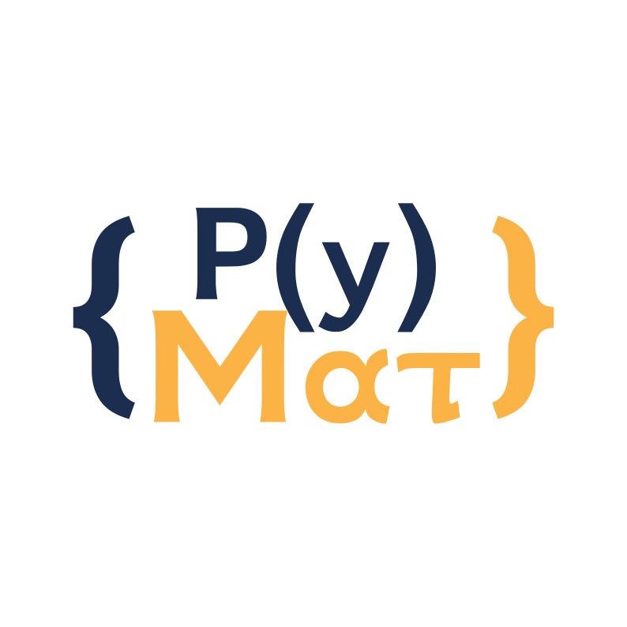

<style>
    :root {
        --color-background: #101010 !important;
	--color-foreground: #1b2d4f !important;
    h1 {
    font-family: IBM Plex Mono;
     }
    
}

header,
footer {
color:#f9b233
}
h3 {
        color: #f9b233;
    }

</style>


<!--  -->


# O ecossistema Python para matemática computacional


### Leon Silva

leon.silva@ufrpe.br

---
# How to write slides

Split pages by horizontal ruler (`---`). It's very simple! :satisfied:

```markdown
# Slide 1

foobar

---

# Slide 2

foobar
```

---
# LaTex

$$ax^2+bx+ c$$
---
# Exemplo imagens 1

 
(two images on the right, appear as two slices. each slice is the 25% of the slide width)

---
# Exemplo imagens 1
 (same of above, but image is 33% of the slide)